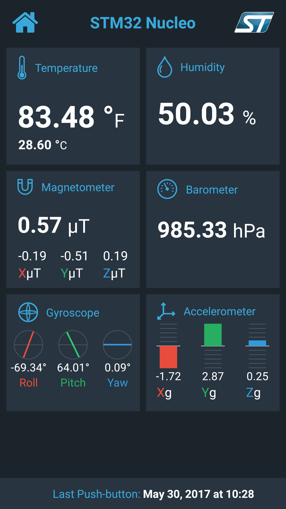
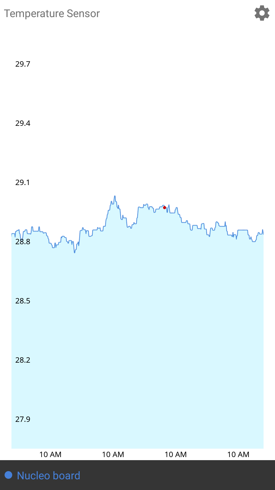

Android app
=============

Android app is another front-end. It fetches and displays the sensors data as well.

##### Contents

- [Overview](#overview)
- [Build Instructions](#build-instructions)

## Overview

It is a native [Android](https://www.android.com/) application which renders the board sensors data as [MPChartLib](https://github.com/PhilJay/MPAndroidChart/tree/master/MPChartLib) charts. On the application start initial data set is fetched from a public API endpoint. 
By default data for last 24 hours is rendered. Charts are updated in real time using data coming from Cloud via MQTT protocol. They have two visualization modes: line and area.

Here are links to app [source code](../android).

  
  

## Build Instructions

1. Download [Android Studio](https://developer.android.com/studio/index.html) v2.0 or above and Android SDK >=15 
1. Import project
1. Go to `app/src/main/assets` and rename the settings template file `settings.dist.json` to `settings.json`
1. Open the settings file and substitute all placeholders in setting values with your AWS account details. See [AWS Setup Guide](./BACKEND.md) for details:
	- `endpoint_hostname` is the [API Gateway](https://aws.amazon.com/api-gateway/) endpoint
	- `customer_specific_endpoint_prefix` is the IoT endpoint prefix. (i.e. "A3YBFPOVDYYAZ5")
1. Build and Start the application

