Back-end
=============

The back-end is entirely powered by [Amazon Web Services](https://aws.amazon.com/). See [platform schema](./OVERVIEW.md#platform-scheme). If you don't have an AWS account, create one. Amazon provides the [AWS Free Tier](https://aws.amazon.com/free/) for new accounts. Demo platform is lightweight and should fit into the free tier limits.

##### Contents

- [Components](#components)
- [Amazon DynamoDB](#amazon-dynamodb)
    - [Sensor Data](#sensor-data)
    - [Weather Data](#weather-data)
- [AWS IoT](#aws-iot)
    - [Certificates](#certificates)
- [AWS Lambda](#aws-lambda)
    - [Build Lambda Functions](#build-lambda-functions)
    - [Create Lambda Functions](#create-lambda-functions)
        - [Get Nucleo Data](#get-nucleo-data)
        - [Nucleo Fetch Weather](#nucleo-fetch-weather)
        - [Generate Nucleo Data](#generate-nucleo-data)
- [Amazon Cognito](#amazon-cognito)
- [Amazon S3](#amazon-s3)
   	
## Components

- [AWS IoT](https://aws.amazon.com/iot/) is used to communicate with the Nucleo board as well as process data coming from the device. Data is automatically processed by [AWS IoT Rules Engine](http://docs.aws.amazon.com/iot/latest/developerguide/iot-rules.html).
- [AWS Lambda](https://aws.amazon.com/lambda/) is a computing component of the platform. Lambdas are used to process data by the IoT rules engine and to implement business logic for the API. There is also a "bot" implemented on Lambdas. Bot emulates Nucleo board and can be used when board is not available and for debugging. In addition to processing Nucleo board data Lambda is used to fetch weather data for a number of cities from [OpenWeatherMap](http://openweathermap.org/) API.
- [Amazon DynamoDB](https://aws.amazon.com/dynamodb/) is a key-value storage where data is persisted by the IoT rules engine and Lambdas.
- API is powered by [Amazon API Gateway](https://aws.amazon.com/api-gateway/).
- [Amazon CloudWatch](http://aws.amazon.com/cloudwatch/) is used as a scheduler.
- [Amazon Cognito](http://aws.amazon.com/cognito/) is used for providing read-only public access to IoT data streams via MQTT over Websockets for the web dashboard.
- Web dashboard is hosted on [Amazon S3](http://aws.amazon.com/s3/).

## Amazon DynamoDB

[DynamoDB](https://aws.amazon.com/dynamodb/) is used as a data storage for the demo platform. We will need two tables: one for sensor data and one for weather data.

### Sensor Data
Create sensor data table with the following parameters:
- Name: `nucleo-metrics`
- Primary partition key: `metric` (String)
- Primary sort key: `timestamp` (Number)

<p align="left">
  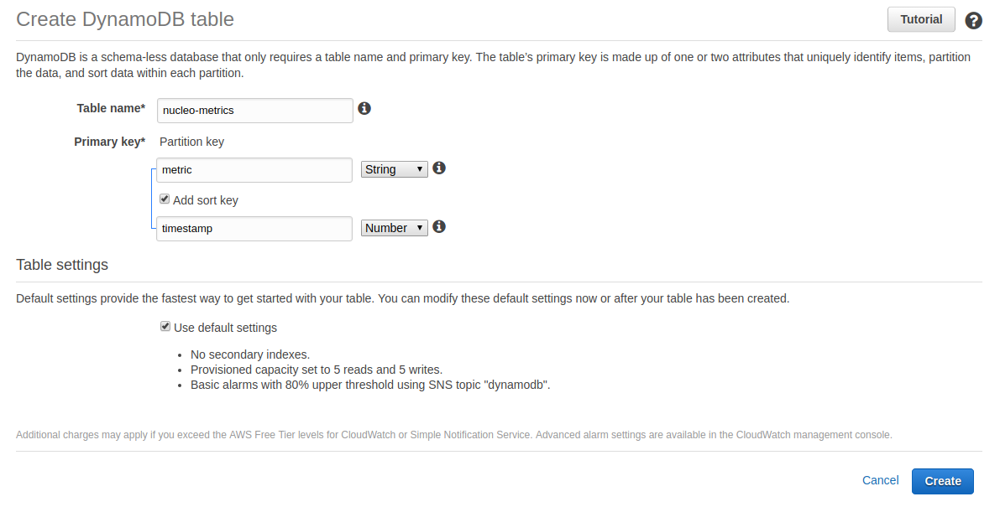
</p>

### Weather Data
Create weather data table with the following parameters:
- Name: `nucleo-weather`
- Primary partition key: `city` (Number)
- Primary sort key: `timestamp` (Number)

<p align="left">
  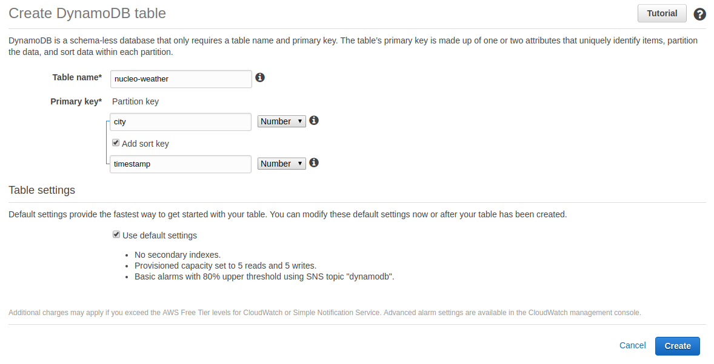
</p>

_NOTE: You can use any table names but don't forget to change them in lambdas code as well._

## AWS IoT

[AWS IoT](https://aws.amazon.com/iot/) works as a middleware between "things" (Nucleo board in our case) and other system components.

_NOTE: This guide is based on latest interface of AWS IoT console._

Open [AWS IoT console](https://aws.amazon.com/iot/).
First register a Thing. You should go to "Registry -> Things" and click "Register a thing".
Name is the only required parameter here. Set it to Nucleo. Thing will reflect the Nucleo board status.

<p align="left">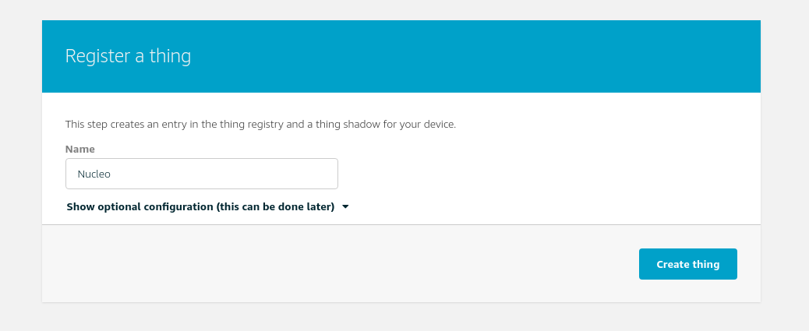</p>

After register the thing we should add Policy. Policy defines access rules for the thing.
In AWS IoT console you should go to "Security -> Policies" and click "Create a policy".
Name it `Nucleo-Policy` and set proper parameters.

<p align="left">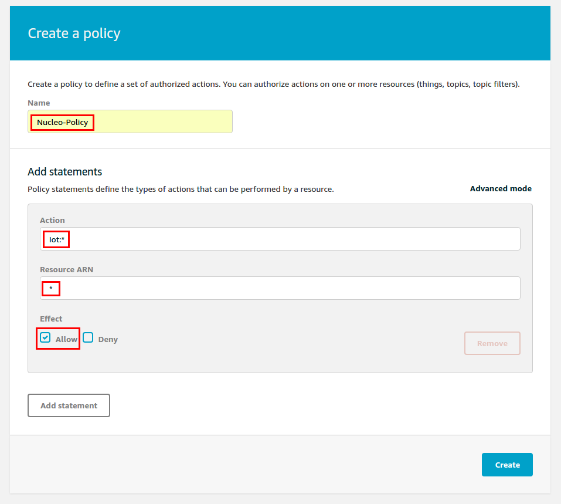</p>

Now we should generate custom [Certificates](#certificates) and register it in AWS IoT.

After that click on "Attach Policy" button. Attach policy `Nucleo-Policy` to the certificate.

<p align="left">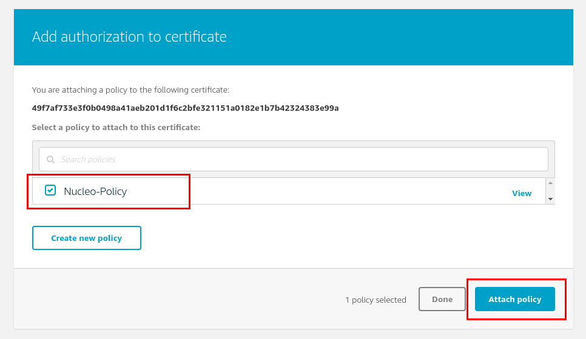</p>

In the next step we will need two rules.

The first rule aim is to store sensor data to [DynamoDB](https://aws.amazon.com/dynamodb/). Click "Create a rule" and set the following parameters:
- Name: any, i.e. `store_temperature`
- Attribute: `state.reported.temperature, state.reported.humidity, state.reported.pressure, state.reported.accelerometer, state.reported.gyroscope, state.reported.magnetometer, timestamp`
- Topic filter: `$aws/things/Nucleo/shadow/update/accepted`
- Choose an Action: "Insert message into a database table (DynamoDB)"
<p align="left">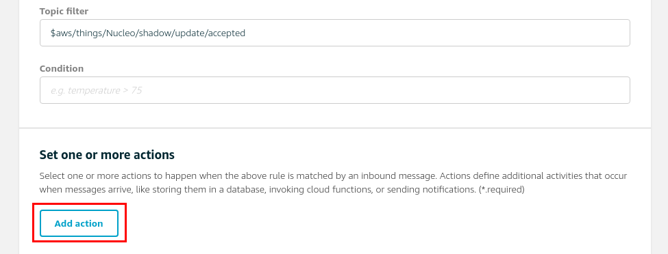</p>

- Table name: select the sensor data table created earlier (nucleo-metrics)
- Hash key value: `temperature`
- Range key value: `${metadata.reported.temperature.timestamp}`
- Write message data to this column: `payload` 
- Role name: click "Create new role" (for example, iot-dynamo-insert-role) and then click "Create a new role". 
- Click "Add action" to create the action.
<p align="left">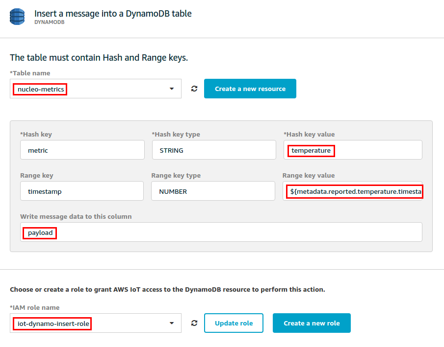</p>

_NOTE: This will generate an [AWS IAM](https://aws.amazon.com/documentation/iam/) role which allows write operations to the table._

Another action should be created for this rule:
1. Select "Republish this item to another topic"
1. Set `Nucleo/data` as the target topic
1. Click "Create a new role" (for example, iot-iot-republish-role) then "Allow"
1. Click "Add action"

<p align="left">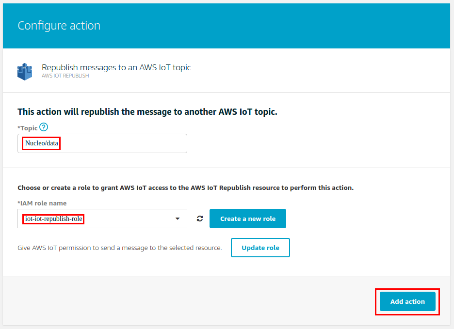</p>
After that submit the rule by clicking "Create rule" button.

<p align="left">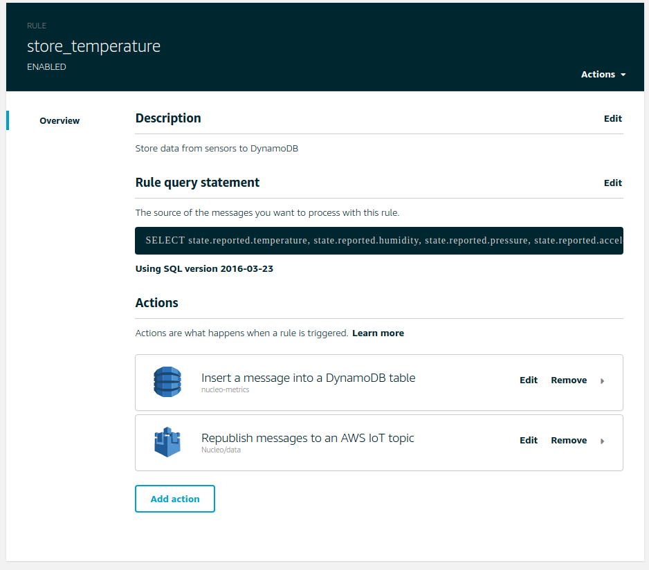</p>

The second rule aim is to store markers. Click "Create a rule" and set the following parameters:
- Name: any, i.e. `store_markers`
- Attribute: `*`
- Topic filter: `Nucleo/data`
- Condition: `marker = true`
<p align="left">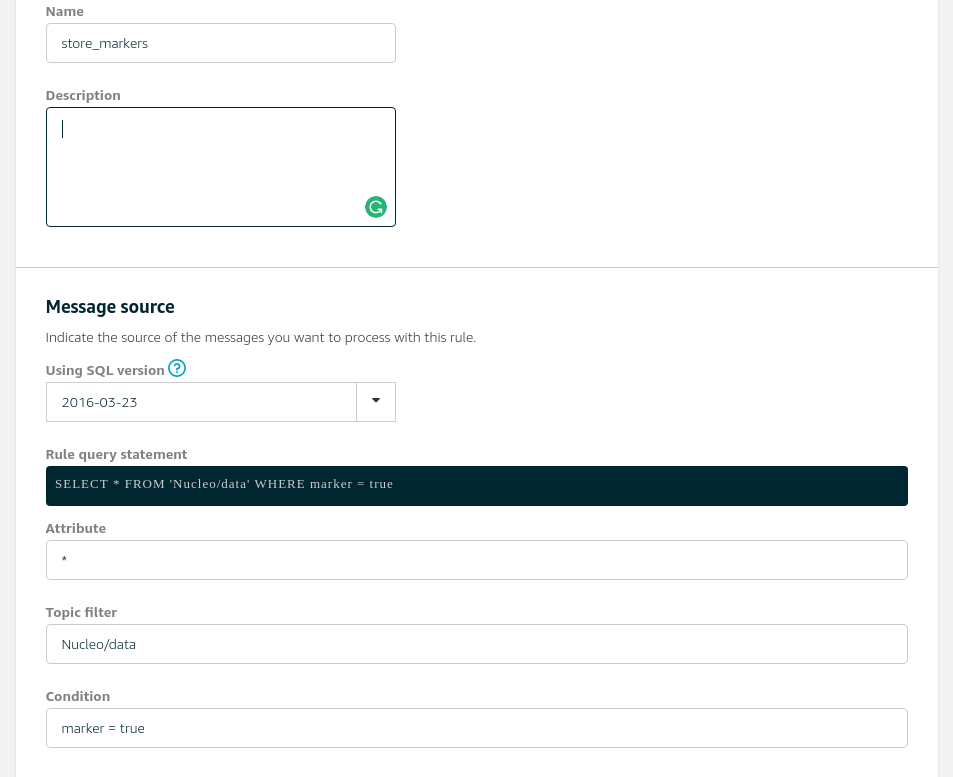</p>

- Choose an Action: "Insert message into a database table (DynamoDB)"
- Table name: select the sensor data table created earlier
- Hash key value: `temperature`
- Range key value: `${timestamp() / 1000}`
- Write message data to this column: `payload` 
- Role name: select the role you generated for the previous rule (`iot-dynamo-insert-role`)
<p align="left">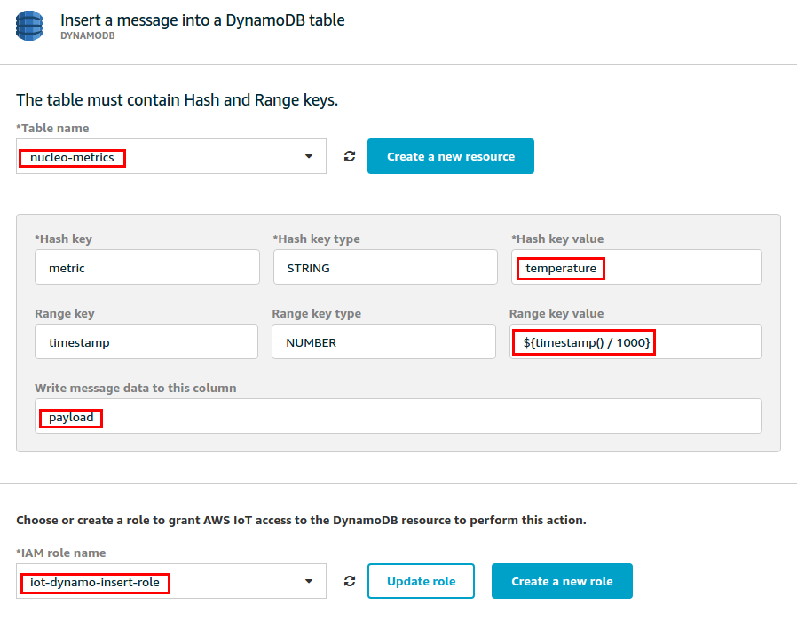</p>

After that submit the rule by clicking "Create rule" button.

<p align="left">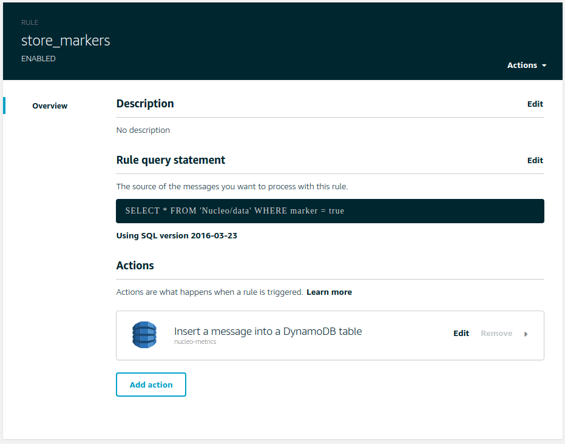</p>

### Certificates

_NOTE: For this step, you should have installed [OpenSSL](https://www.openssl.org/)._

First, you should generate a private key (local) using a standard elliptic curve prime256v1 over a 256-bit prime field.
Run following command terminal (Mac OS / Linux):
```bash
openssl ecparam -genkey -name prime256v1 -out nucleo.key.pem 
```
<p align="left">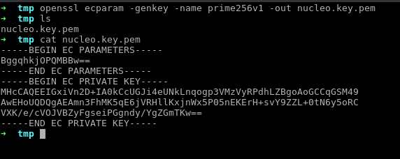</p>

Next step is to make signing request (CSR). You will be prompted for additional information.
Run following command terminal (Mac OS / Linux):
```bash
openssl req -new -sha256 -key nucleo.key.pem -out nucleo.csr
```
<p align="left">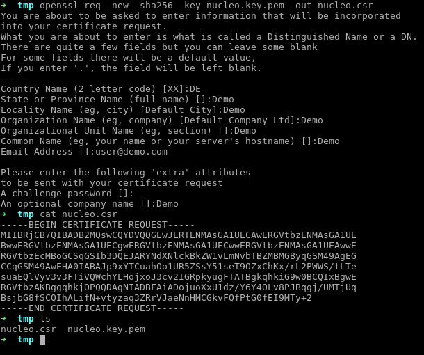</p>

After that in AWS IoT console, you should go to "Security -> Certificates" and click "Create a certificate". Choose "Create with CSR". 
<p align="left">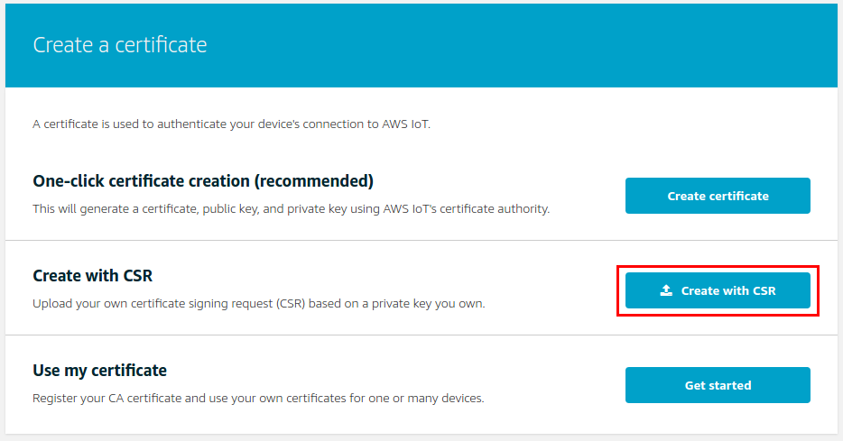</p>

Upload file `nucleo.csr` which we generate before.
After that save generated certificate (rootCA) in the local folder.

<p align="left">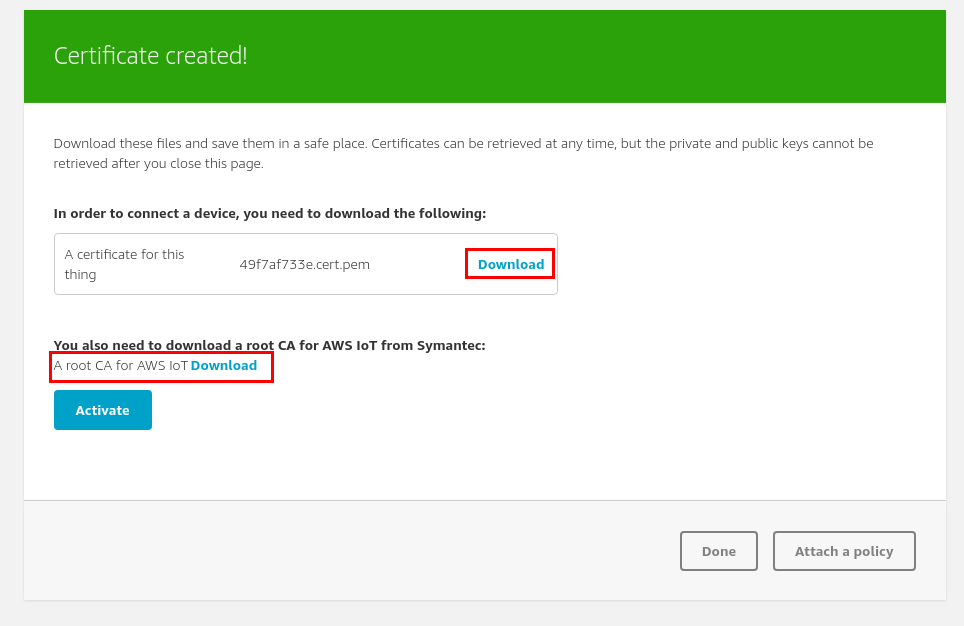</p>

As the result you will get following on your local folder.

<p align="left">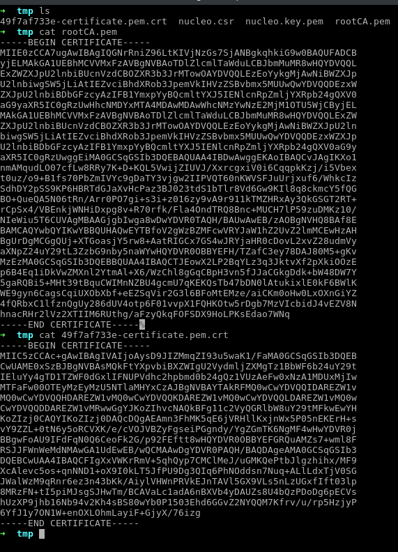</p>

Finally, activate your certificate in AWS IoT console:
<p align="left">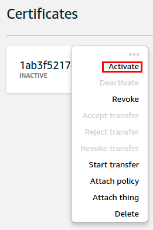</p>


## AWS Lambda

There are three [Lambdas](https://aws.amazon.com/lambda/) which should be set up. See the [lambdas folder](../aws/lambdas/) for their sources.

### Build Lambda Functions
First we need to build lambdas:
[Install Node.js](https://nodejs.org/en/download/package-manager/)

Copy the `config.dist.js` file as `config.js`:
    ```
    cp config.dist.js config.js
    ```
    
Edit the `config.js` file. There is one configuration parameter: IoT endpoint hostname. It is unique for every AWS account. You can get it in [AWS IoT console](https://aws.amazon.com/iot/). Go to the console and click (Registry -> Things -> Nucleo -> Interact), then copy and paste the hostname to the `iotEndpoint` config parameter.
<p align="left">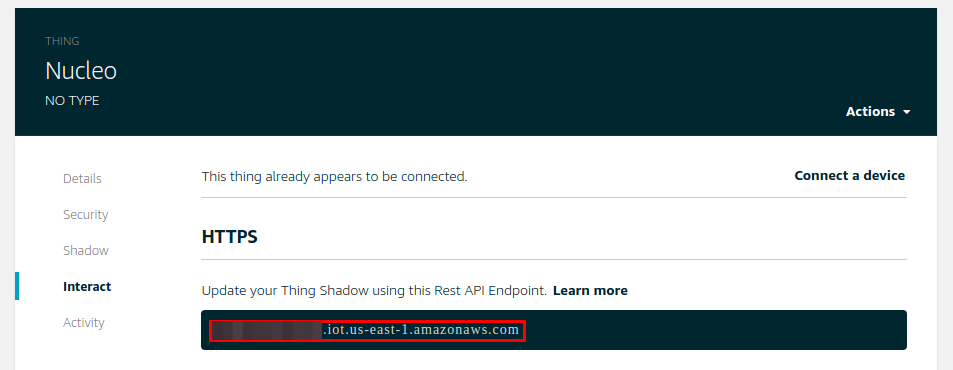</p>

To build lambdas run in command line:
    ```
    npm i && npm run build && npm run zip
    ```

### Create Lambda Functions   
Now there is a ZIP file for each lambda in the `dist` folder. Open the [AWS Lambda](https://aws.amazon.com/lambda/) console and create lambda for each file.

Choose "Create Lambda function" (or "Get Started Now", if it's a new AWS account).
<p align="left">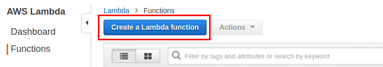</p>

On the Select blueprint page choose the "Blank Function" blueprint.
<p align="left">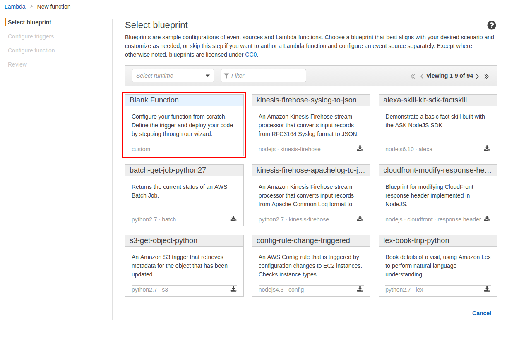</p>

Configure triggers page will be populated. Choose Next.
<p align="left">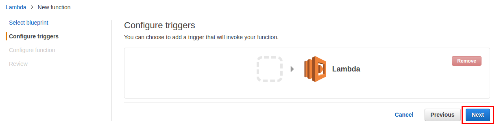</p>

On the Configure function page, do the following:
    1. Give a name to the function and select Node.js 6.10 runtime
    2. Set "Code entry type" to "Upload a *.ZIP file", click "Upload" and select the corresponding ZIP file
<p align="left">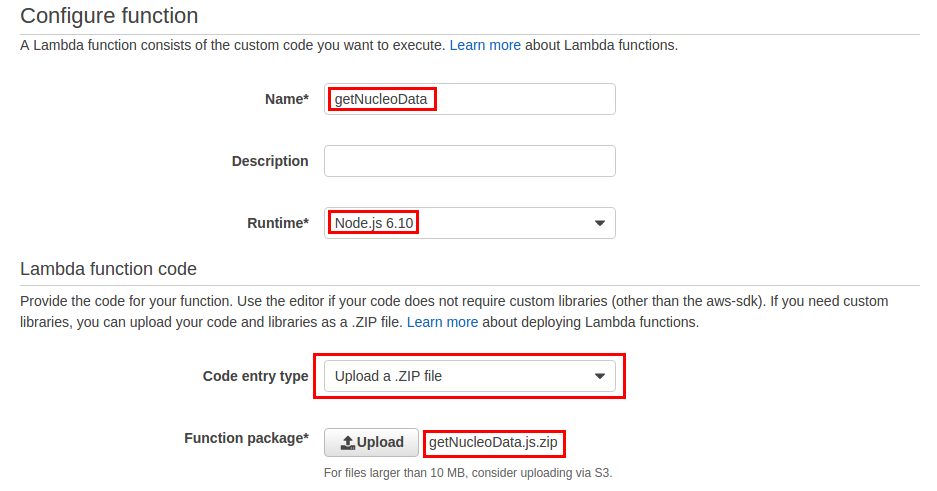</p>

Choose "Create a role" in Role. Enter a role name for a new role that will be created (for example, lambda-dynamo-role). Click Allow.
<p align="left">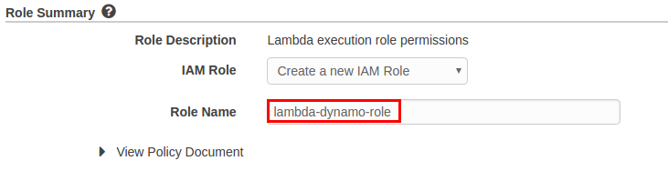</p>

Open IAM console and select "lambda-dynamo-role" in Roles tab.

Click "Attach Policy" and select "AmazonDynamoDBFullAccess" on Permissions tab. Click "Attach Policy".
<p align="left">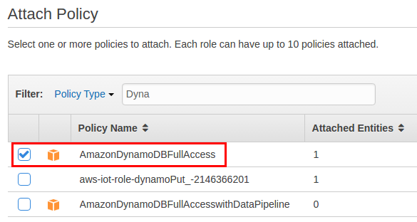</p>

Come back on the Configure function page and review "Lambda function handler and role" section:
<p align="left">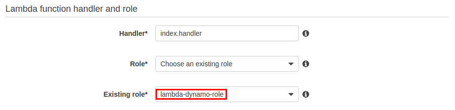</p>

_NOTE: Select this role for the next lambdas as well._

In "Advanced settings" set:
  - Memory: 256 MB
  - Timeout: 10 sec
<p align="left">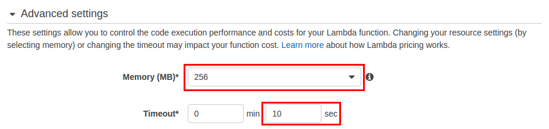</p>

Click "Next" then "Create function"

#### Get Nucleo Data

The `getNucleoData` lambda provides initial data set for client applications. We need to assign an API endpoint to it so that clients will be able to call it remotely. 

To do that click "Add trigger":
<p align="left">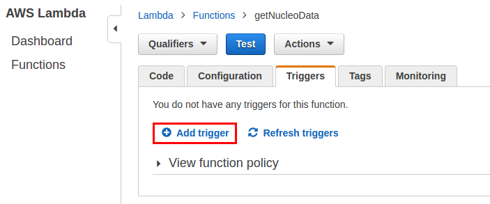</p>

Then select "API Gateway". 
<p align="left">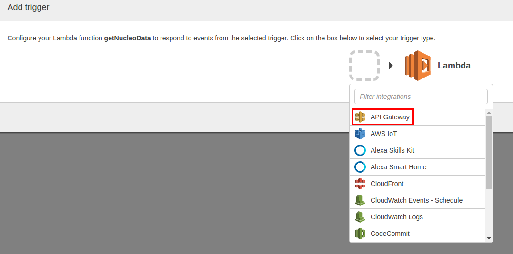</p>

Click "Submit".
<p align="left">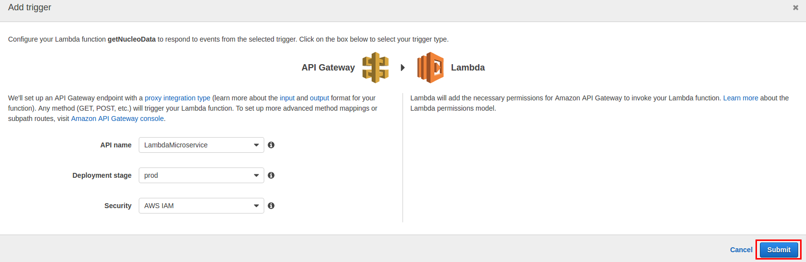</p>

_NOTE: Any method (GET, POST, etc.) will trigger your Lambda function. To set up more advanced method mappings or subpath routes visit Amazon API Gateway console._

Go to [Amazon API Gateway](https://aws.amazon.com/api-gateway/) console and click on the API created within the previous step.
<p align="left"></p>

Choose Create Method from the Actions drop-down menu. For the HTTP method, choose GET, and then save your choice:
<p align="left"></p>

_NOTE: Delete ANY._

For Integration type in GET method Setup pane choose Lambda Function. For Lambda Region choose the region (.e.g, us-east-1) where you created the Lambda functions. In Lambda Function type getNucleoData. Choose Save to finish setting up the integration request for this method.
<p align="left">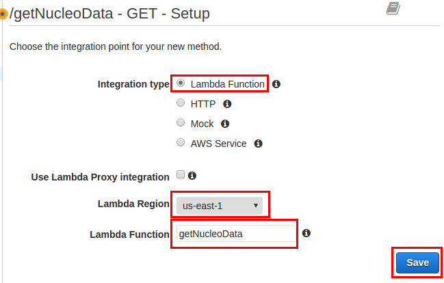</p>

_NOTE: For Add Permission to Lambda Function, choose OK._

In the GET method click on "Method Request".

Choose "AWS IAM" in Authorization.

Expand "URL Query String Parameters" and click on "Add query string".

Add "metric" and "since" parameters (use "Add query string" link).
<p align="left">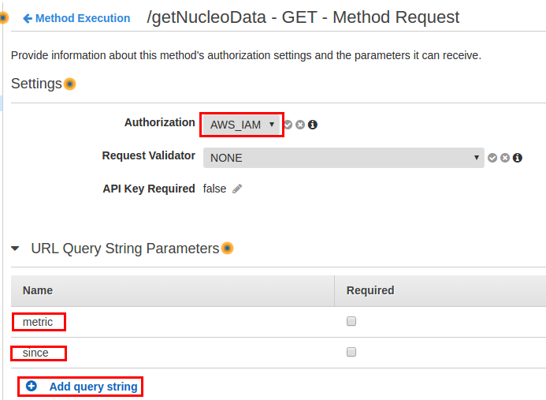</p>

Return to Method Execution.

Click on "Integration Request" and expand "Body Mapping Templates".

Click on "Add mapping template" and specify `application/json` as content type.

Copy and paste this JSON into text area:

    ```
	{
        "metric": "$input.params('metric')",
        "since": $input.params('since')
    }
    ```
Click "Save"

Select resource in the resources list and click "Actions"

Select "Enable CORS" and then click on "Enable CORS and replace existing CORS headers"

Now the API endpoint is open and available for invocation by user browsers.

#### Nucleo Fetch Weather
The `nucleoFetchWeather` lambda fetches weather data for a number of cities from [OpenWeatherMap](http://openweathermap.org/) API. Historical data is not available for free accounts so we have to fetch current data from time to time to build temperature history. In order to be able to invoke the API [sign up](https://home.openweathermap.org/users/sign_up) for a free account, get an API key, copy and paste it into the `owmApiKey` variable value.

In order to invoke the lambda periodically we can use [Amazon CloudWatch](http://aws.amazon.com/cloudwatch/) scheduling service. [AWS Lambda](https://aws.amazon.com/lambda/) console provides handy functionality to set up the invocation schedule:

Go to [AWS Lambda](https://aws.amazon.com/lambda/) console and click on the lambda.

Go to the "Triggers" tab and click on "Add trigger".

Select "CloudWatch Events - Schedule" as event source type.
<p align="left">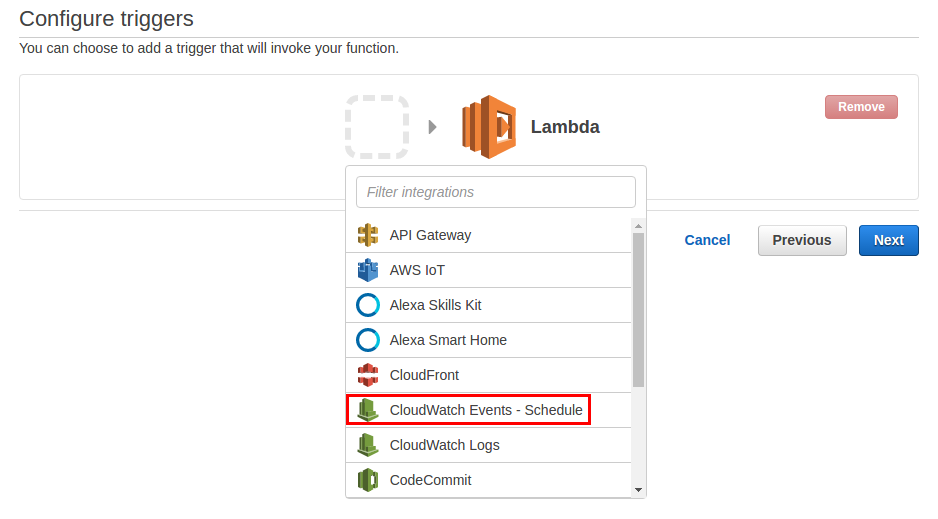</p>

Give a name for the rule and select a schedule expression, i.e. "rate (15 minutes)"
<p align="left">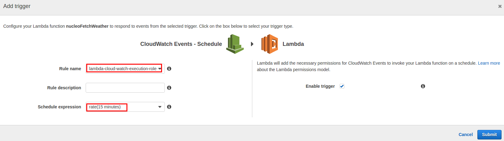</p>

Make sure the "Enable trigger" checkbox is checked and click "Submit" button.

#### Generate Nucleo Data
The `generateNucleoData` lambda is an optional one. It emulates the Nucleo board activity by updating its shadow and generating markers. You can set up an API endpoint or invocations scheduler similar to previous lambdas.

Repeat steps from "getNucleoData" for API endpoint:

1. Add "marker" parameter in "URL Query String Parameters".
1. Copy and paste this JSON into text area in "Body Mapping Templates":
       
```
{
    "marker": $input.params('marker')
}
```

Or repeat steps from "nucleoFetchWeather" for scheduler with 1 minute rate.

_NOTE: For intervals, less than 1 minute, you could setup EC2 instance and call API endpoint in custom script._

This lambda requires more privileges in order to publish to IoT data streams. Perform the following steps to grant it access:

Go to IAM console and then to "Roles" section
Select the role you generated for the lambdas
Click "Create Role Policy" then "Custom Policy" then "Select" button
Give a name to the policy (for example, lambda-iot-publish-role) and copy and paste the following JSON into the "Policy Document" text area:

    ```
    {
        "Version": "2012-10-17",
        "Statement": [
            {
                "Effect": "Allow",
                "Action": [
                    "iot:*"
                ],
                "Resource": [
                    "*"
                ]
            }
        ]
    }
    ```
<p align="left"></p>

## Amazon Cognito

We use [Amazon Cognito](http://aws.amazon.com/cognito/) to provide public read-only access to IoT data streams.

Configuration here is pretty simple. Open Cognito console, go to "Manage Federated Identities" and create new identity pool. Give it any name (for example, Nucleo Metrics) and set the "Enable access to unauthenticated identities" checkbox. 
<p align="left">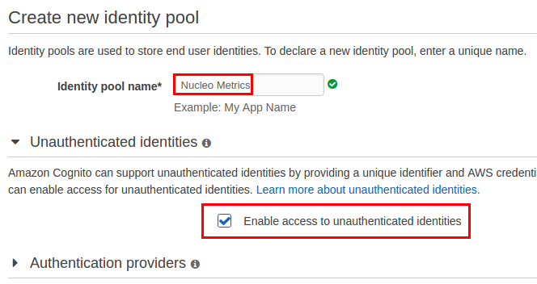</p>

Along with the pool an IAM role will be generated. This role will not grant access to our IoT topics by default. We need to extend it:

1. In [Cognito](http://aws.amazon.com/cognito/) console go to the just created pool and click "Edit identity pool"
1. Note the authenticated and unauthenticated role names. We will need them on the next step.
1. Go to [IAM console](https://aws.amazon.com/documentation/iam/)
1. Go to Roles and find roles from the previous step and do the following for both:
  1. Click on the role
  1. Click "Create Role Policy"
  1. Click "Custom Policy" then "Select"
  1. Give it any name (for example, cognito-iot-publish-auth-role) and paste the following text into the "Policy Document" text area:

      ```
      {
          "Version": "2012-10-17",
          "Statement": [
              {
                  "Effect": "Allow",
                  "Action": [
                      "iot:*"
                  ],
                  "Resource": [
                      "*"
                  ]
              }
          ]
      }
      ```
  1. Click "Apply Policy"

## Amazon S3

Web dashboard is a static web application which can be hosted on [Amazon S3](http://aws.amazon.com/s3/). Just create a bucket and configure it as described in [this guide](https://docs.aws.amazon.com/AmazonS3/latest/dev/HowDoIWebsiteConfiguration.html).