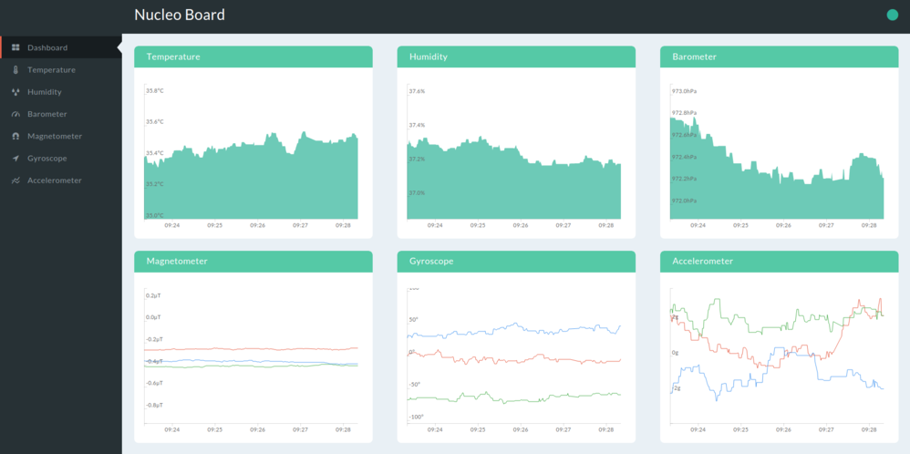

Web Dashboard
=============

Dashboard is a demo front-end implemented as a web application.

##### Contents

- [Overview](#overview)
- [Build Instructions](#build-instructions)
- [Deployment (optional)](#deployment-optional)

## Overview

  

It is a [React](https://facebook.github.io/react/) application which renders the board sensors data as [D3.js](https://d3js.org/) charts. On the application start initial data set is fetched from a public API endpoint. 
By default data for last 4 hours is rendered. Charts are updated in real time using data coming from Cloud via MQTT over Websocket protocol. They have two visualization modes: line and area.

Here are links to dashboard [source code](../dashboard) and [live demo](http://iot-demo.nucleo.klika-tech.com/#/dashboard).

## Build Instructions

In order to build dashboard application follow steps below:

1. [Install Node.js](https://docs.npmjs.com/getting-started/installing-node)
1. Run `npm install`. This will install dependencies.
1. Rename `src/config.dist.js` to `src/config.js` and update the configuration parameters. See [AWS Setup Guidse](aws/SETUP.md) for AWS parameters details.
1. Run `npm run build`. This will build application. Its files are now in `dist` folder.

## Deployment (optional) 

One of the simplest hosting options is Amazon S3. In order to deploy the application to S3 do the following:

1. Configure an S3 bucket to host a website as described in the [AWS Setup Guide](aws/SETUP.md)
1. [Install and configure AWS CLI](http://docs.aws.amazon.com/cli/latest/userguide/cli-chap-getting-set-up.html)
1. Deploy application files with the command `aws s3 sync dist/ s3://<your.bucket.name>/`