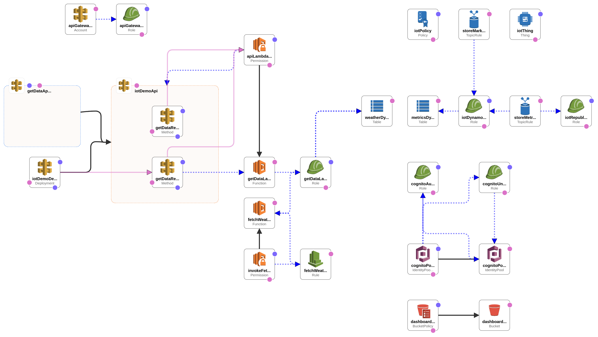

Guides
======

This section allows you to get a quick setup of the environment.

##### Contents

- [AWS Setup via CloudFormation](#aws-setup-via-cloudformation)
- [Setup Firmware via Mbed](#setup-firmware-via-mbed)

## AWS Setup via CloudFormation

_NOTE: This instruction is for Linux/MacOS users ONLY_

[AWS CloudFormation](https://aws.amazon.com/cloudformation/) is a service that helps you model and set up your Amazon Web Services resources so that you can spend less time managing those resources and more time focusing on your applications that run in AWS. You create a template that describes all the AWS resources that you want (like Amazon EC2 instances or Amazon RDS DB instances), and AWS CloudFormation takes care of provisioning and configuring those resources for you. You don't need to individually create and configure AWS resources and figure out what's dependent on what; AWS CloudFormation handles all of that.

For an easy setup, we prepare a stack template which sets up all [Backend](./BACKEND.md), except [Generate Nucleo Data Lambda](./BACKEND.md#generate-nucleo-data), generates certificates and signs them, setups and deploys [Web Dashboard](./DASHBOARD.md).

Here is the link to the [stack template](../aws/cloudformation/stack.yml).
You can see the stack schema below.

  

### Environment Requirements

1. [AWS CLI](https://aws.amazon.com/cli/) (>=1.11.160) must be [installed](http://docs.aws.amazon.com/cli/latest/userguide/installing.html) and [configured](http://docs.aws.amazon.com/cli/latest/userguide/cli-chap-getting-started.html) (Power User Access recommended).
1. [OpenSSL](https://www.openssl.org/)(>=1.0.2) must be installed.
1. [jq](https://github.com/stedolan/jq) (>=1.5) must be installed.
1. [NodeJS](https://nodejs.org/en/) (node>=6.11.0, npm>=3.10.10) must be installed.

### Install

Open terminal, change directory to [cloudformation directory](../aws/cloudformation/) and execute following command:

`$ install.sh <cf_stack_name> <region> <owm_api_ky>`

* **cf_stack_name** - Name for CloudFormation Stack
* **region** - Stack deploy region (like: us-east-1)
* **owm_api_ky** - Open Weather Map API Key, more details [here](https://openweathermap.org/appid).

After stack installation, all certificates will be located in `aws/cloudformation/tmp` folder and printed in console.
_Note: for Nucleo Board and mobile app configuration please visit [documentation](../README.md)._

### Uninstall

For terminating allocated AWS resources you can use uninstall script.

Open terminal, change directory to [cloudformation directory](../aws/cloudformation/) and execute following command:

`$ uninstall.sh`

## Setup Firmware via Mbed

[Mbed](https://www.mbed.com/en/) is a platform and operating system for internet-connected devices based on 32-bit ARM Cortex-M microcontrollers. Such devices are also known as Internet of Things devices. The project is collaboratively developed by ARM and its technology partners.

For a simpler firmware build process, we've prepared [mbed project template](https://os.mbed.com/teams/Klika-Tech/code/Nucleo-AWS-IoT-mbed/) and [instruction](https://os.mbed.com/teams/Klika-Tech/code/Nucleo-AWS-IoT-mbed/wiki/Homepage).