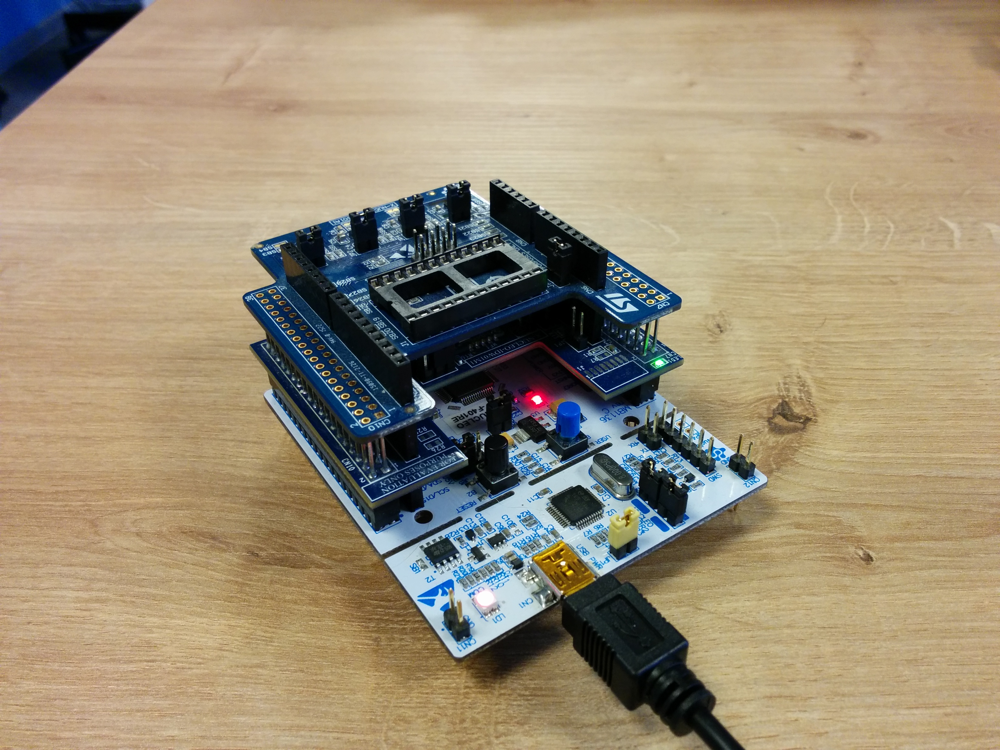
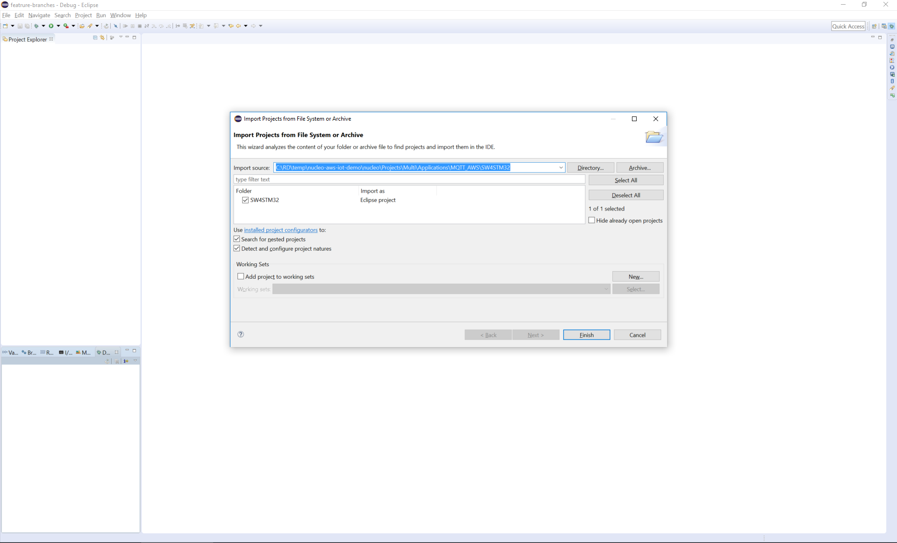
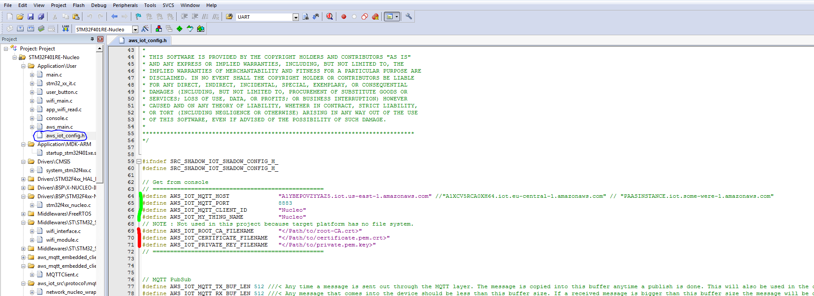
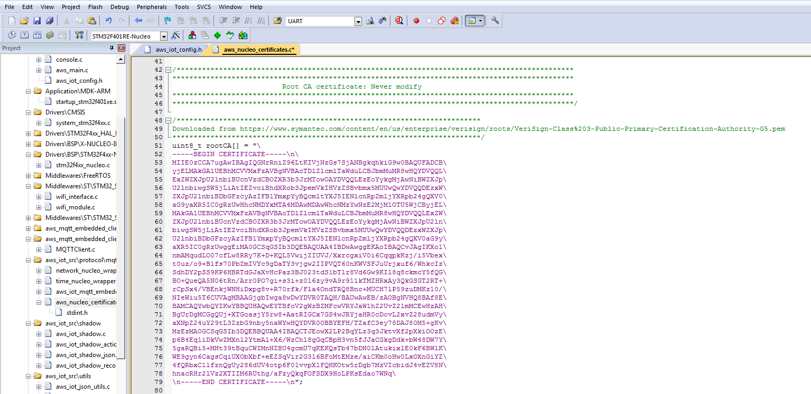
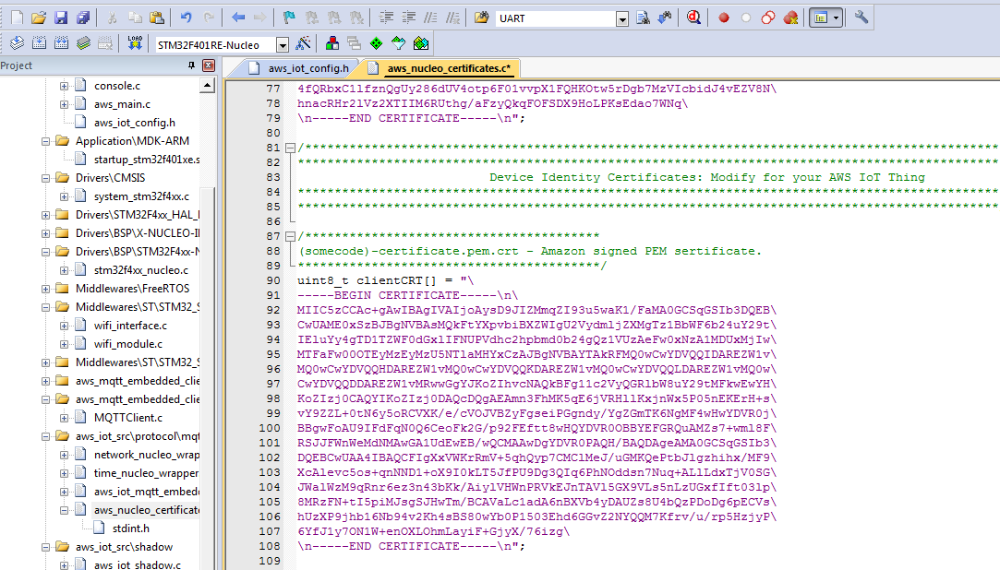
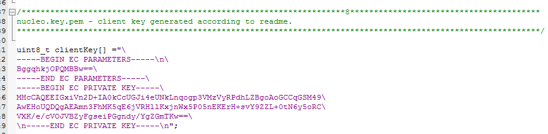
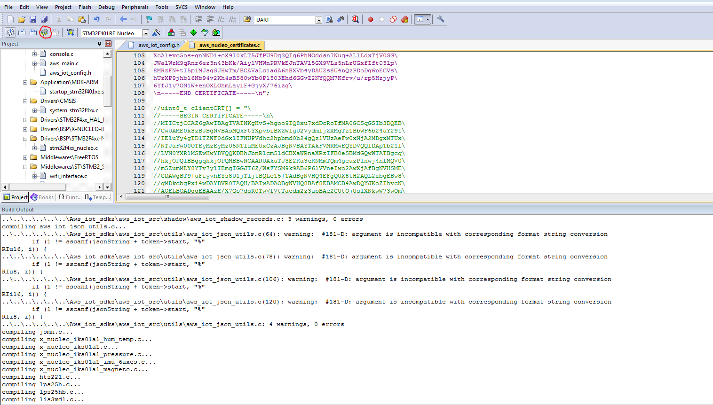
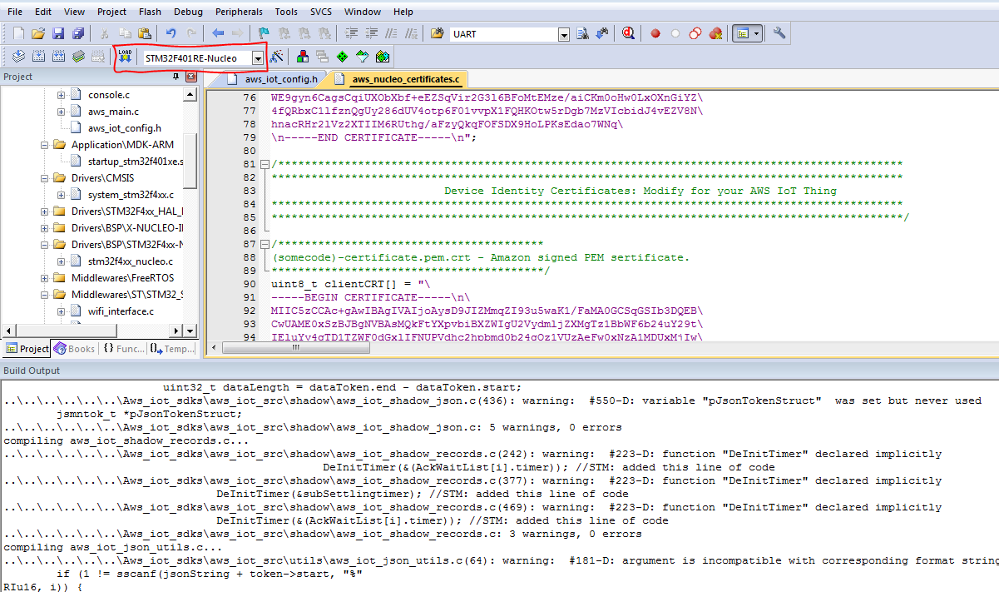
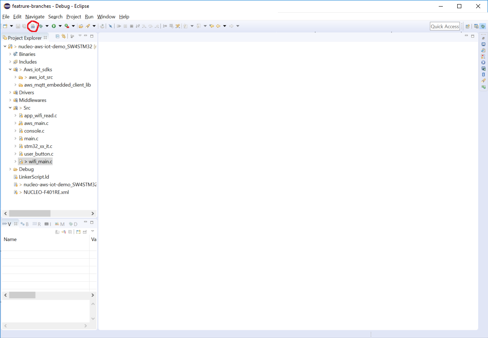

Device (STM32 Nucleo)
=============

The demo device is STM32 Nucleo-64 board with WiFi and sensors expansions. The board is a "thing" for the [AWS IoT](https://aws.amazon.com/iot/) service. It updates its shadow with sensors data every second.

##### Contents

- [Hardware configuration](#hardware-configuration)
- [Build Instruction](#build-instruction)
	- [Setup AWS IoT connection options](#setup-aws-iot-connection-options)
	- [Setup device certificates](#setup-device-certificates)
	- [Setup WiFi credentials](#setup-wifi-credentials)
	- [Setup debug messages](#setup-debug-messages)
- [Deploy to device](#deploy-to-device)	   				
	- [Deploy to device from Keil](#deploy-to-device-from-keil)
	- [Deploy to device from SW4STM32 (System Workbench)](#deploy-to-device-from-system-workbench)
	-  [After deploying](#after-deploying)
	
## Hardware configuration

- [NUCLEO-F401RE](http://www.st.com/en/evaluation-tools/nucleo-f401re.html) - Nucleo Development Board
- [X-NUCLEO-IDW01M1](http://www.st.com/content/st_com/en/products/ecosystems/stm32-open-development-environment/stm32-nucleo-expansion-boards/stm32-ode-connect-hw/x-nucleo-idw01m1.html) - Wi-Fi expansion board for STM32 Nucleo
- [X-NUCLEO-IKS01A1](http://www.st.com/content/st_com/en/products/ecosystems/stm32-open-development-environment/stm32-nucleo-expansion-boards/stm32-ode-sense-hw/x-nucleo-iks01a1.html) - Motion MEMS and environmental sensor expansion board for STM32 Nucleo

<p align="left"></p>

## Build Instruction
There are two ways to build firmware for AWS IoT communication.
1) Use [online mbed compiler](https://os.mbed.com/compiler/#nav:/;) and this [instruction](https://os.mbed.com/users/PavelSavyhin/code/Nucleo-AWS-IoT-mbed/).
2) Use standalone tools, follow next steps to do it.

Projects are generated for [Keil uVision](http://www2.keil.com/mdk5/uvision/) and [SW4STM32](http://www.st.com/en/development-tools/sw4stm32.html).
See [this folder](../nucleo/) for sources.

First of all download [ST-LINK](http://www.st.com/en/embedded-software/stsw-link009.html) Driver for Nucleo and install it.
After that download and install [Keil MDK-ARM](https://www.keil.com/demo/eval/arm.htm) or [SW4STM32](http://www.st.com/en/development-tools/sw4stm32.html).

_NOTE: You can use professional version of Keil uVision for free 7 days (trial period)_

Run Keil uVersion.
Choose "Project -> Open Project ..." and select project file.
Project files are here [here](../nucleo/Projects/Multi/Applications/MQTT_AWS/MDK-ARM/STM32F401RE-Nucleo/)

After that open project and download recommended software packs for STM in the wizard.

Run System Workbench for STM32.
Choose "File->Open Projects from file System->Directory" and select folder with project file. Project files are here [here](../nucleo/Projects/Multi/Applications/MQTT_AWS/SW4STM32/). And press "Finish".

<p align="left"></p>

### Setup AWS IoT connection options

In order to setup AWS IoT connection options [in this file](../nucleo/Projects/Multi/Applications/MQTT_AWS/Inc/aws_iot_config.h) should be adjusted

Overwrite following constants:

```c
#define AWS_IOT_MQTT_HOST               "XXXXXXXXXXXXXX.iot.us-east-1.amazonaws.com"
#define AWS_IOT_MQTT_PORT               8883
#define AWS_IOT_MQTT_CLIENT_ID          "Nucleo"
#define AWS_IOT_MY_THING_NAME           "Nucleo"
```

Substitute the AWS_IOT_MQTT_HOST value with your AWS IoT endpoint (to find out the endpoint go to AWS IoT console and click the small question mark on the right).
AWS IoT subscription topic parameters and message are defined [here](../nucleo/Projects/Multi/Applications/MQTT_AWS/Inc/aws_main.h) and [here](../nucleo/Projects/Multi/Applications/MQTT_AWS/Src/aws_main.c). 

_NOTE: Settings below aren't used by the application. See next section on how to configure certificates._

```c
#define AWS_IOT_ROOT_CA_FILENAME        "root-CA.crt"
#define AWS_IOT_CERTIFICATE_FILENAME    "132c58eafa-certificate.pem.crt"
#define AWS_IOT_PRIVATE_KEY_FILENAME    "132c58eafa-private.pem.key"
```
<p align="left"></p>

###  Setup device certificates

In order to setup device certificates edit [this file](../nucleo/Aws_iot_sdks/aws_iot_src/protocol/mqtt/aws_iot_embedded_client_wrapper/platform_nucleo/aws_nucleo_certificates.c)

Documentation on generating and signing device certificates can be found in [AWS IoT setup guide](BACKEND.md#certificates).

_NOTE: Escape string special characters._

Copy content of file `rootCA.pem` to array initialization `uint8_t rootCA[]`.
<p align="left"></p>

Copy content of file `49f7af733e-certificate.pem.crt` to array initialization `uint8_t clientCRT[]`.
<p align="left"></p>

Copy content of file `nucleo.key.pem` to array initialization `uint8_t clientKey[]`.
<p align="left"></p>

### Setup WiFi credentials

In order to setup Wi-Fi AP credentials edit [this file](../nucleo/Projects/Multi/Applications/MQTT_AWS/Src/wifi_main.c) 

```c
#define APPLICATION_HARDCODE_SSID 1

// Wifi SSID and Password 
#define DEFAULT_SSID 	"test_home"
#define DEFAULT_SECKEY 	"1234567890"
#define DEFAULT_MODE 	WPA_Personal
```

Or set APPLICATION_HARDCODE_SSID in 0 and set wifi network, security mode and secret key from console via USB.

### Setup debug messages
In order to setup Wi-Fi AP credentials edit [this file](../nucleo/Projects/Multi/Applications/MQTT_AWS/Src/wifi_main.c) 

```c
#define APPLICATION_DEBUG_MSG			0
```
Set this macro to 1 to increase amount of message printed to serial port.

After that plug-in developer board to PC via USB. 

## Deploy to device

### Deploy to device from Keil:
Rebuild project in Keil.

<p align="left"></p>

And load result to developer board.

<p align="left"></p>

### Deploy to device from SW4STM32 (System Workbench):
Rebuild project in SW4STM32.

<p align="left"></p>

And load result to developer board.

<p align="left"></p>

### After deploying
After that push reset button (black button) on developer board.

For board state monitoring you can connect to board via a Serial protocol (you can use [PuTTy](http://www.putty.org/)).
In order to connect use following settings:

1. Serial line: `<COM port of board>`
1. Speed: 115200
